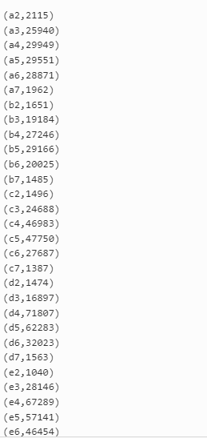
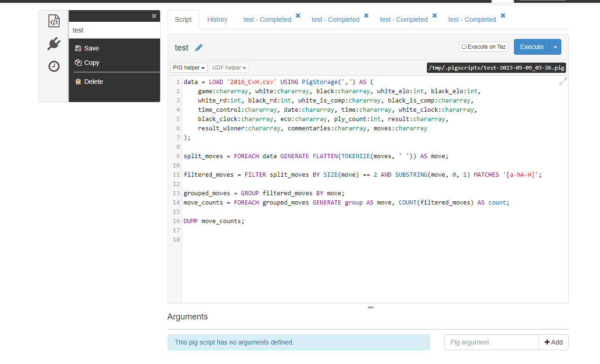

### Pig Result

### Pig Script

## Test what system is faster? HD map reduce or Tez

Map reduce is for me faster cause tez runs out of memory // never executes the pig scripts cause it crashes every time

Github link: https://github.com/24628/hadoop-assignment
